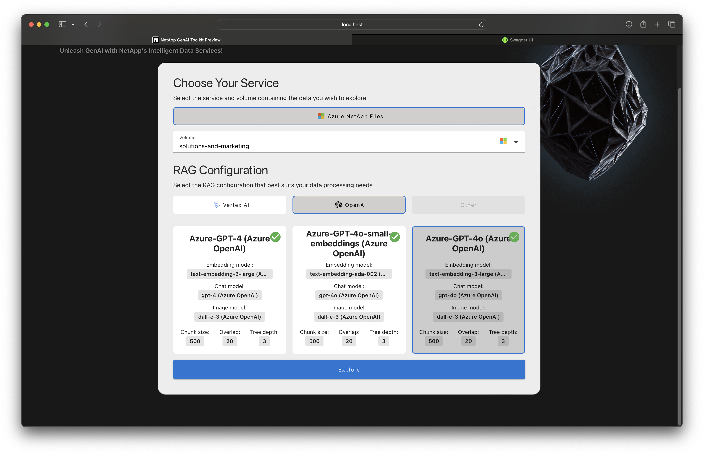
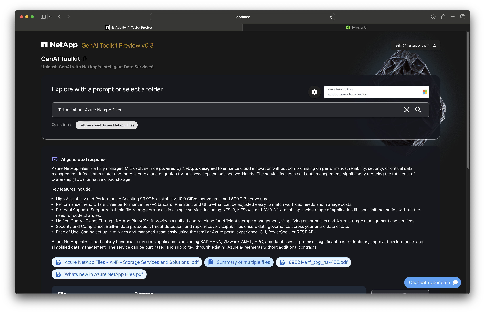
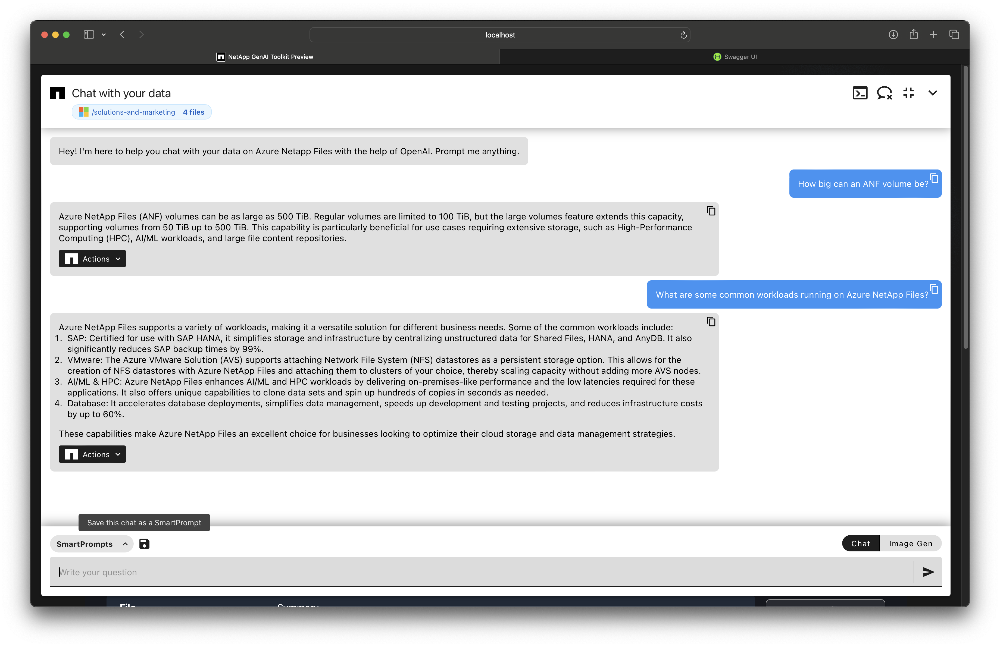
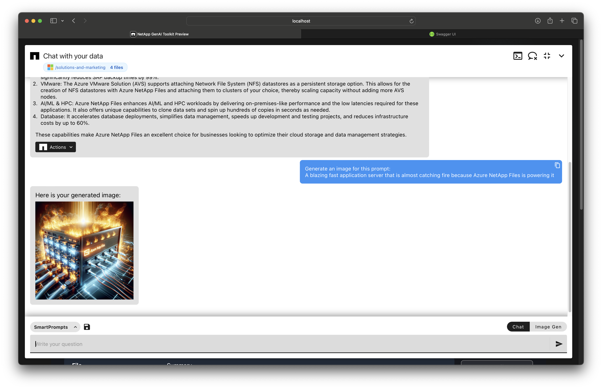
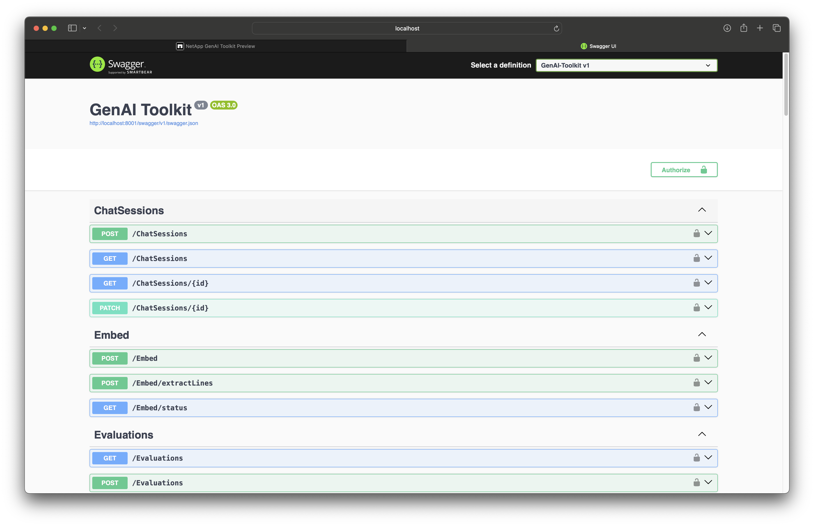

# Terraform deployments for NetApp's GenAI Toolkit
This repository hosts Terraform deployment scripts to deploy the NetApp GenAI toolkit. See READMEs in the specific cloud provider directories for more information. 

To get the GenAI toolkit up and running, please follow the instructions specific to your chosen cloud provider. For more detailed information, refer to the link below.

[Link to ANF instructions](anf/README.md)

[Link to GCP instructions](gcp/README.md)

Once the GenAI toolkit is up and running, you will need to add your API key to your user account after creating it. Therefore, a prerequisite for using the service is having access to the API key for the AI model you intend to use. If you intend to use an Azure OpenAI key, please note that you need to apply for access, which may take up to 24 hours to be granted.

If you encounter any issues with getting the GenAI toolkit up and running or configuring the AI models, please visit our [Discussions page](https://github.com/NetAppLabs/genai-toolkit-terraform-deployment/discussions) or send an email to hinrik@netapp.com.

# What is NetApp's GenAI Toolkit?

A self-managed cloud native solution with an easy to use UI and API to get started with GenAI, RAG workflows, Chatbots and AI assistants building with unstructured data on Azure NetApp Files or Google Cloud NetApp Volumes. Use it standalone (it has a great UI) or as a component in custom workflows via its API.

## Provides:
- Enterprise level Document Search through LLM vector embeddings (auto embeds with built in PGVector DB)
- Chatbot (RAG) UI/API
- RAG model evaluations
- Exportable Smart Prompts/Chatbot endpoints
- (Assistants/Agents TBD)

## Screenshots (on Azure):

## Changelog
v0.3:
- Azure Support with Azure NetApp Files
- PGVector is now the default vector database (Can change for Instaclustr or Azure Flex Server)
- RAG evaluations
- SmartPrompts
- Azure OpenAI and OpenAI models

v0.2:
- GCP Support with Google Cloud NetApp Volumes
- Prompt API
- Chat UI
- Search/Explore
- Gemini and Claude3 models from VertexAI
